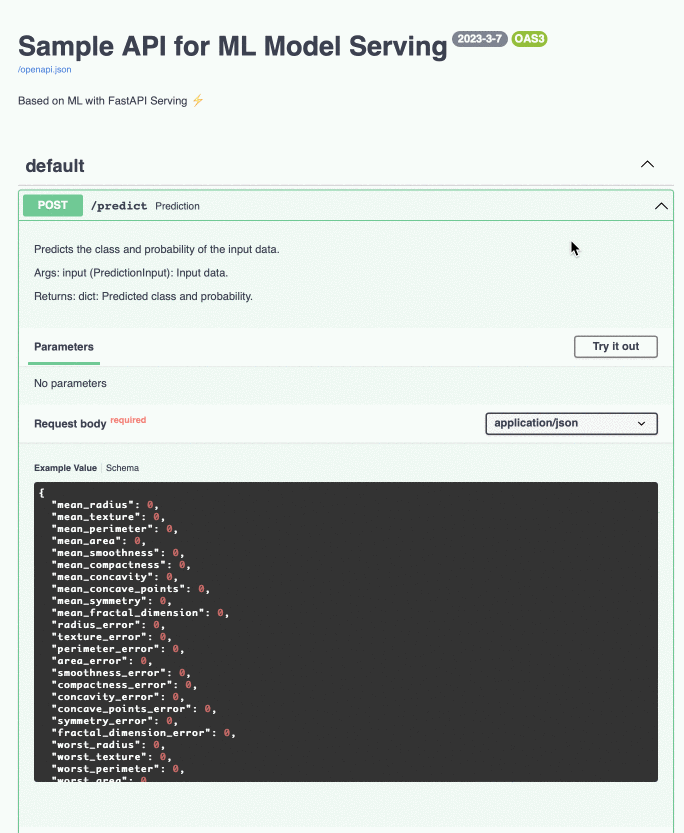

<<<<<<< HEAD
# Sample FastAPI for ML Model Serving


This code is a simple API that serves an ML model using FastAPI. It is intended to be used as a starting point for building more complex ML serving APIs.


### Sample
Here's a sample of what you can expect to see with this project:



# Getting Started

You have two options to start the application: using Docker or locally on your machine.

## Using Docker
Start the application with the following command:
```
docker-compose up
```

## Locally
To start the application locally, follow these steps:

1. Install the required packages:

```
pip install -r requirements.txt
```
2. Start the application:
```
python main.py
```
*Note: You can change the address and port in the config file **config_prod.yml***

## FAST API Docs url:
http://0.0.0.0:8003/docs#/

---
# 🚀 Code Examples

The following code demonstrates how to perform model predict and receive the results in JSON format:
```python
import requests

api_host = 'http://0.0.0.0:8003/'
type_rq = 'predict'

input_data = {
        'mean_radius': 18.94,
        'mean_texture': 21.31,
        'mean_perimeter': 123.6,
        'mean_area': 1130.0,
        'mean_smoothness': 0.09009,
        'mean_compactness': 0.1029,
        'mean_concavity': 0.108,
        'mean_concave_points': 0.07951,
        'mean_symmetry': 0.1582,
        'mean_fractal_dimension': 0.05461,
        'radius_error': 0.7888,
        'texture_error': 0.7975,
        'perimeter_error': 5.486,
        'area_error': 96.05,
        'smoothness_error': 0.004444,
        'compactness_error': 0.01652,
        'concavity_error': 0.02269,
        'concave_points_error': 0.0137,
        'symmetry_error': 0.01386,
        'fractal_dimension_error': 0.001698,
        'worst_radius': 24.86,
        'worst_texture': 26.58,
        'worst_perimeter': 165.9,
        'worst_area': 1866.0,
        'worst_smoothness': 0.1193,
        'worst_compactness': 0.2336,
        'worst_concavity': 0.2687,
        'worst_concave_points': 0.1789,
        'worst_symmetry': 0.2551,
        'worst_fractal_dimension': 0.06589
        }

response = requests.post(api_host+type_rq, json=input_data)

data = response.json()     
print(data)
```

Output:
```
{'prediction_Id': '46400d9d-5178-41a0-a85f-9ffc91d80e92', 'predict': 0, 'predict_prob': 0.0031117206298359678}
```

---
# Test
This repository contains functional tests for a program to ensure the proper operation of the service.

## Getting Started Test
To get started with the testing process, you first need to set up the necessary environment. This can be achieved by either installing the required packages or by running the Docker container.

#### 1. Installing Required Packages:
Run the following command to install the necessary packages:
```
pip install -r requirements.txt
```

Alternatively, you can also run the tests inside a Docker container. To do so, follow these steps:
Start the Docker container:
```
docker-compose up
```
Find the container ID:
```
docker ps
```
Connect inside the container:
```
docker exec -it {CONTAINER_ID}
```

#### 2. Run the tests from the program directory:
Once you have set up the environment, navigate to the program directory and run the tests using the following command:
```
pytest -v --disable-warnings
```

If all tests pass successfully, you will see the following result: 
```bash
tests/test_main.py::test_health_endpoint PASSED               [ 50%]
tests/test_main.py::test_predict PASSED                       [100%]
```


## Dependencies

The following dependencies are required to run this code:

* FastAPI
* uvicorn
* pandas
* numpy
* pydantic
* catboost
* Docker
=======
# Grupo 10 — IAAC: Deteção de Conexões Maliciosas

Projeto da unidade curricular IAAC (Introdução à Aprendizagem Automática e Ciência de Dados). Objetivo: construir um classificador que identifica, a partir de registos de rede (NetFlow-like), conexões maliciosas vs. benignas, para apoiar a triagem de alertas de um SOC (Security Operations Center).

## Estado do projeto

| Área | Estado |
|---|---|
| ML Canvas / Business Understanding | Feito (decisões documentadas abaixo) |
| EDA (univariada, bivariada, multivariada, avançada) | Feito |
| Data Preparation (split, pipeline, desbalanceamento) | Feito |
| Modelação (comparação de modelos, afinação de threshold) | Feito |
| Avaliação final no conjunto de teste | Feito — critérios de sucesso cumpridos |
| Documentação do Data Understanding (dicionário de dados) | Por fazer |
| Branches individuais / Pull Requests da equipa | Por fazer — depende de cada elemento |

Backlog completo com user stories, sprint board e templates Scrum: [`Backlog_Scrum_IAAC.xlsx`](./Backlog_Scrum_IAAC.xlsx).

## Estrutura do repositório

```
.
├── app/
│   ├── models/          # modelos treinados/exportados (a preencher)
│   └── tests/           # testes automatizados (a preencher)
├── datasets/
│   ├── Raw/              # dados originais (cybersecurity_network_logs.csv)
│   └── Process/          # dados tratados/transformados (a preencher pelo pipeline)
├── models/               # artefactos de modelo (ex: preprocessor.joblib)
├── notebooks/
│   ├── EDA_cybersecurity.ipynb                # análise exploratória completa
│   ├── Data_Preparation_cybersecurity.ipynb    # split, pipeline, baseline
│   └── Modelling_cybersecurity.ipynb           # comparação de modelos, threshold, avaliação final
├── Backlog_Scrum_IAAC.xlsx
└── README.md
```

## Dataset

`datasets/Raw/cybersecurity_network_logs.csv` — 25.000 conexões de rede, 6 colunas:

| Coluna | Descrição |
|---|---|
| `Protocol` | Protocolo de rede (TCP / UDP / ICMP) |
| `Packet_Size_Bytes` | Tamanho do pacote (bytes) |
| `Connection_Duration_ms` | Duração da conexão (ms) |
| `Failed_Logins` | Número de tentativas de login falhadas |
| `Geo_Distance_km` | Distância geográfica estimada da origem (km) |
| `Is_Malicious` | Alvo — 1 = maliciosa, 0 = benigna (prevalência ≈ 4,99%) |

Sem valores nulos nem duplicados. Dataset aparenta ser sintético e limpo — os resultados de um baseline devem ser interpretados com cautela por causa disso.

## Principais decisões (Business Understanding)

- **Momento da predição:** fim da conexão (flow-based, compatível com NetFlow) — `Connection_Duration_ms`, `Packet_Size_Bytes` e `Failed_Logins` só estão completos nesse momento.
- **Custo de erro:** falso negativo ≈ 500€ (incidente não detetado) vs. falso positivo ≈ 8€ (tempo de análise) — proporção ~60:1 a favor do recall.
- **Critérios de sucesso:** recall ≥ 90% com taxa de falsos positivos ≤ 1%.
- **Holdout:** modo alerta (sem bloqueio automático) durante a validação inicial, para não contaminar os dados com o efeito do próprio modelo.

## Principais achados da EDA

- `Failed_Logins ≥ 3` é o sinal isolado mais forte (93–100% das conexões maliciosas).
- `Packet_Size_Bytes` e `Geo_Distance_km` discriminam bem mas de forma bimodal/não-linear (dois perfis de ataque: pacotes grandes vs. pequenos) — Pearson e Spearman divergem por isso.
- `Connection_Duration_ms` e `Protocol` têm pouco poder discriminativo isolado.
- Não remover outliers de `Packet_Size_Bytes`/`Geo_Distance_km` — são, em larga medida, as próprias conexões maliciosas.

Detalhe completo: [`notebooks/EDA_cybersecurity.ipynb`](./notebooks/EDA_cybersecurity.ipynb).

## Pipeline de preparação de dados

Split estratificado 70/15/15 → feature `High_Failed_Logins` (`Failed_Logins >= 3`) → `ColumnTransformer` (log1p + escalonamento nas variáveis assimétricas, escalonamento simples nas restantes, one-hot em `Protocol`) → `class_weight="balanced"` para o desbalanceamento.

Baseline (Random Forest, sem tuning) em validação: recall 89,3%, precisão 97,7%, taxa de falsos positivos 0,11%. Muito perto do critério de recall ≥ 90%; como a margem de falsos positivos é grande, o próximo passo é afinar o threshold de decisão.

Detalhe completo: [`notebooks/Data_Preparation_cybersecurity.ipynb`](./notebooks/Data_Preparation_cybersecurity.ipynb).

## Modelação e resultado final

Comparação por validação cruzada (5-fold, só no treino) entre Regressão Logística e Random Forest — o Random Forest venceu claramente (PR-AUC 0,926 vs. 0,866), confirmando a relação não-linear encontrada na EDA.

Threshold de decisão afinado na validação (0,5 → **0,465**) para recuperar recall sem violar o limite de falsos positivos.

**Avaliação final no conjunto de teste (usado uma única vez):**

| Métrica | Alvo | Resultado |
|---|---|---|
| Recall | ≥ 90% | **93,6%** |
| Taxa de falsos positivos | ≤ 1% | **0,08%** |
| PR-AUC | — | 0,957 |

De 187 conexões maliciosas no teste, o modelo deteta 175 (12 falsos negativos) e gera apenas 3 falsos positivos em 3.563 benignas. **Os dois critérios de sucesso do Business Understanding foram cumpridos.**

⚠️ O dataset parece sintético e muito limpo (sinal quase perfeito em `Failed_Logins`) — estes resultados são provavelmente otimistas face a tráfego real. Recomenda-se validar com dados de produção antes de qualquer bloqueio automático, mantendo entretanto o modo "alerta apenas".

Modelo final treinado e pronto a usar: [`models/model_final.joblib`](./models/model_final.joblib) (pipeline completo + threshold = 0,465). Carregar com:

```python
import joblib
bundle = joblib.load("models/model_final.joblib")
pipeline, threshold = bundle["pipeline"], bundle["threshold"]

proba = pipeline.predict_proba(X_novo)[:, 1]
pred = (proba >= threshold).astype(int)
```

Detalhe completo: [`notebooks/Modelling_cybersecurity.ipynb`](./notebooks/Modelling_cybersecurity.ipynb).

## Como correr os notebooks

```bash
python -m venv .venv
.venv\Scripts\activate      # Windows
pip install pandas numpy matplotlib seaborn scipy scikit-learn jupyter joblib

jupyter notebook notebooks/
```

## Próximos passos

1. Documentar o Data Understanding (dicionário de dados e limitações) para o relatório final.
2. Cada elemento criar a sua branch e preencher a coluna "Responsável" no backlog.
3. Validar o modelo com dados de produção/reais antes de considerar qualquer bloqueio automático (o dataset atual é provavelmente sintético e otimista).
4. Escrever o relatório final do projeto, reunindo Business Understanding, EDA, Data Preparation e Modelação.

## Equipa e organização

Cada elemento trabalha numa branch própria a partir das user stories do backlog (ver `Backlog_Scrum_IAAC.xlsx`, coluna "Branch"). Fluxo sugerido:

```bash
git checkout -b nome-do-elemento/numero-da-story
# ... trabalho ...
git add .
git commit -m "descrição da alteração"
git push -u origin nome-do-elemento/numero-da-story
```

Depois, abrir Pull Request para `main` e pedir revisão a outro elemento do grupo antes do merge.
>>>>>>> 2e505bd (Adiciona modelação final (comparação de modelos, threshold, avaliação no teste), atualiza README e backlog)
