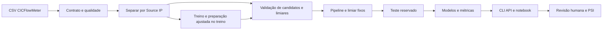
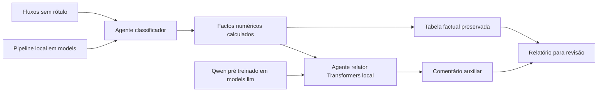
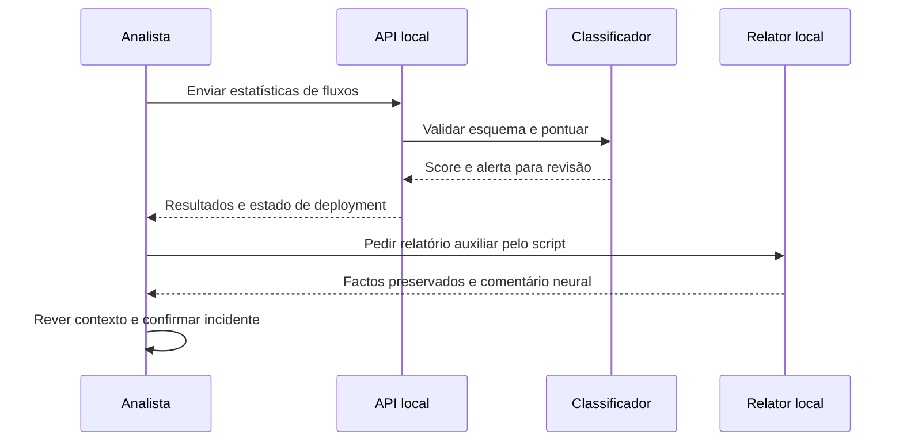

# Arquitetura e caso de uso

## Pipeline CRISP ML

## Agentes em Python e LangGraph

A versão direta chama as funções sequencialmente. A versão LangGraph liga os mesmos agentes num StateGraph. O LLM explica genericamente a revisão humana; os factos agregados são preservados separadamente no relatório. Não define scores, limiares ou bloqueios. O modelo generativo é pré-treinado, não afinado com este dataset.

## Caso de uso no SOC

Os diagramas cobrem a componente Trojan disponível. A integração com os outros datasets exige os respetivos dados, modelos e contratos de previsão do grupo.
